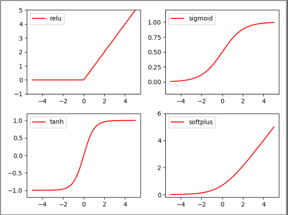
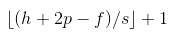

<script type="text/javascript" src="http://cdn.mathjax.org/mathjax/latest/MathJax.js?config=default"></script>
[TOC]
----
## 1. 激励函数分类
```
        x = torch.linspace(-5, 5, 200)
        y_sigmoid = torch.sigmoid(x)
        y_relu = F.relu(x)
        y_tanh = torch.tanh(x)
        y_softplus = F.softplus(x)
```



## 2. 构建分类网络
### 1. 造数据
```
x = torch.unsqueeze(torch.linspace(-1, 1, 100), dim=1)  # 1:从上往下加维度 shape: [100, 1]    0:从左往右加维度 shape: [1,100]
y = x.pow(2) + 0.2 * torch.rand(x.size()) # y = x^2 + 高斯白噪声  从0-1中取x.size()个值
```
### 2. 建立神经网路
```
class Net(nn.Module):

	def __init__(self, n_feature, n_hidden, n_output):
		super(Net, self).__init__()
		# 传入子类类名来确定是属于哪个子类的父类， 再传入子类对象
		self.hidden = nn.Linear(n_feature, n_hidden)  # 隐藏层线性输出
		self.predict = nn.Linear(n_hidden, n_output)  # 输出层线性输出

	# 重写了module中的forward
	def forward(self, x):
		x = F.relu(self.hidden(x))
		x = self.predict(x)
		return x
```
### 3. 实例化网络
```
net = Net(n_feature=1, n_hidden=10, n_output=1)
```
### 4. 训练网络
#### 4.1 准备优化器及损失函数
```
optimizer = torch.optim.SGD(net.parameters(), lr=0.2)  # 传入net的所有参数，学习率
loss_func = torch.nn.MSELoss()  # 预测值和真实值之间的误差计算公式(MSE)   均方差损失
```
### 5. 可视化训练过程
```
plt.ion()  # 交互式画图开启

for t in range(150):  # 迭代对数据进行训练

	prediction = net(x)  # input x and predict based on x

	loss = loss_func(prediction, y)  # must be (1. nn output, 2. target)   计算两者间的误差

	optimizer.zero_grad()  # clear gradients for next train  清空上一步的残余更新参数
	loss.backward()  # backpropagation, compute gradients  误差反向传播，计算参数更新值
	optimizer.step()  # apply gradients  将参数更新值施加到net的paramters上，即对参数进行优化

	if t % 5 == 0:
		# plot and show learning process
		plt.cla()
		plt.scatter(x, y)
		plt.plot(x.data.numpy(), prediction.data.numpy(), 'r-', lw=5)
		plt.text(0.5, 0, 'Loss=%.4f' % loss, fontdict={'size': 20, 'color': 'red'})
		plt.pause(0.1)

plt.ioff() # 交互式画图关闭
plt.show()
```

## 10.卷积神经网络 
### 10.1 卷积
####  1.卷积性质
1. 卷积核的个数决定卷积生成特征图的通道数
2. 输入特征图的通道数决定单个卷积核的深度
3. 通常一个kernel包含多层filter
4. 卷积操作后的特征图的尺度满足： 
5. 当stride=1时，想要 con2d 出来的图片长宽没有变化, padding=(kernel_size-1)/2

#### 2.卷积原则
    - 卷积过程不压缩长宽，只改变channel数，尽量保留更多的信息
    - polling阶段压缩长宽，不改变channel数

##### 3.卷积函数 
###### nn.Conv1() 及 nn.Conv2() nn.Conv3() 区别与联系
[nn.Conv1d和nn.Conv2d理解](https://blog.csdn.net/Elva_23/article/details/83826587)
- 一维卷积函数  
        
        nn.Conv1d()卷积时对纵列进行卷积
        nn.Conv1d(in_channels, out_channels, kernel_size, stride=1, padding=0, dilation=1, groups=1, bias=True)
- 二维卷积函数
        
        nn.Conv2d(in_channels, out_channels, kernel_size, stride=1, padding=0, dilation=1, groups=1, bias=True)
    
    


nn.Conv2()


#### 代码过程
##### 引入数据
    # 超参设置
    EPOCH = 1
    BATCH_SIZE = 50
    LR = 0.001
    DOWNLOAD_MNIST = False # True:去新下载   False:不用再下载
        
    # 处理数据
    if not(os.path.exists("./mnist/")) or not(os.listdir("./mnist/")):
        # mnist文件夹不存在 或者 mnist文件夹中为空，则下载mnist数据集
        DOWNLOAD_MNIST = True
    
    train_data = torchvision.datasets.MNIST(
        root="./mnist/",
        train=True,
        transform=torchvision.transforms.ToTensor(),
    
        download=DOWNLOAD_MNIST,
    )

##### 构建网络


## 11. 循环神经网络(RNN)
### 1. 作用
    用来处理序列化数据
   - [RNN推导博客](https://www.cnblogs.com/pinard/p/6509630.html)
    
    
    1. x(t)代表在序列索引号t时训练样本的输入。同样的，x(t−1)和x(t+1)代表在序列索引号t−1和t+1时训练样本的输入。
    2. h(t)代表在序列索引号t时模型的隐藏状态。h(t)由x(t)和h(t−1)共同决定。
    3. o(t)代表在序列索引号t时模型的输出。o(t)只由模型当前的隐藏状态h(t)决定。
    4. L(t)代表在序列索引号t时模型的损失函数。
    5. y(t)代表在序列索引号t时训练样本序列的真实输出。
    6. U,W,V这三个矩阵是我们的模型的线性关系参数，它在整个RNN网络中是共享的，
       这点和DNN很不相同。 也正因为是共享了，它体现了RNN的模型的“循环反馈”的思想。
       
### 2. 问题
    存在梯度消失的情况，难以处理长序列的数据，故而提出RNN的特例LSTM（Long Short-Term Memory）
### 3. 梯度消失与梯度爆炸
[梯度消失与梯度爆炸博客](https://www.jianshu.com/p/243ab5aff906)
#### 问题产生:
    层数比较多的神经网络模型在使用梯度下降法对误差进行反向传播时会出现梯度消失和梯度爆炸问题
    - 梯度消失发生时，靠近输出层的隐藏层权值更新正常，靠近输入层的隐藏层权值几乎不变，接近于初始化的权值，
      导致输入层附近的隐藏层相当于只起到一个函数映射的作用，相当于DNN的学习只是后几层的隐藏层在学习。
    - 梯度爆炸发生在初始权值过大，靠近输入层的权值变化比靠近输出层的权值变化更快。
#### 问题解决:
    - 用ReLU、Leaky ReLU、PReLU、RReLU、Maxout等替代sigmoid函数。
    - 用Batch Normalization。
    - LSTM的结构设计也可以改善RNN中的梯度消失问题。
#### Batch Normalization解决梯度爆炸思路
    # TODO
#### LSTM的结构解决梯度爆炸思路
    # TODO

## 12. LSTM(长短期记忆)
    相比RNN多出了3个控制器
    - 输入控制器
    - 输出控制器
    - 忘记控制器
   


    
     


